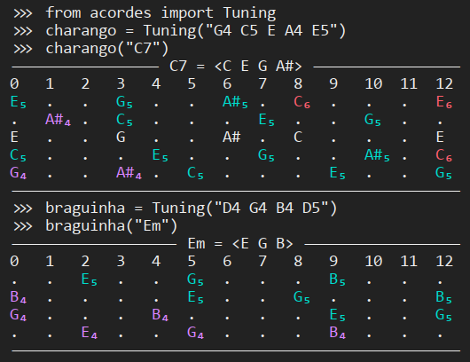

"Acordes" means "chords" in Spanish and Portuguese. It will help you determine how to play a chord on a stringed instrument. There are many sites dedicated to guitar or ukulele chords, but for some other instruments, chord tables are harder to find.

# Usage

```pycon
>>> from acordes import Tuning
>>> charango = Tuning("G4 C5 E A4 E5")
>>> charango("C7")
----------------- C7 = <C E G A#> -----------------
0   1   2   3   4   5   6   7   8   9   10  11  12
E₅  .   .   G₅  .   .   A#₅ .   C₆  .   .   .   E₆
.   A#₄ .   C₅  .   .   .   E₅  .   .   G₅  .   .
E   .   .   G   .   .   A#  .   C   .   .   .   E
C₅  .   .   .   E₅  .   .   G₅  .   .   A#₅ .   C₆
G₄  .   .   A#₄ .   C₅  .   .   .   E₅  .   .   G₅
---------------------------------------------------
>>> braguinha = Tuning("D4 G4 B4 D5")
>>> braguinha("Em")
------------------- Em = <E G B> ------------------
0   1   2   3   4   5   6   7   8   9   10  11  12
.   .   E₅  .   .   G₅  .   .   .   B₅  .   .   .
B₄  .   .   .   .   E₅  .   .   G₅  .   .   .   B₅
G₄  .   .   .   B₄  .   .   .   .   E₅  .   .   G₅
.   .   E₄  .   .   G₄  .   .   .   B₄  .   .   .
---------------------------------------------------
```


Supported tuning descriptions are:
- notes with octave numbers: `D4 G4 B4 D5`
- octave-invariant notes: `G C E A`
- mix of the two: `G4 C5 E A4 E5`

Supported chord descriptions are (examples with C as the root note):
- with two notes: C5, C(no5), Cm(no5)
- with three notes: C, Cm
- with four notes: C7, CM7, Cm7, CmM7

If octave numbers are present in the tuning, the notes in the output are colored so that notes of the same color form a non-inverted chord.

# Development

Check types: `mypy acordes`

Run tests: `python test.py`
