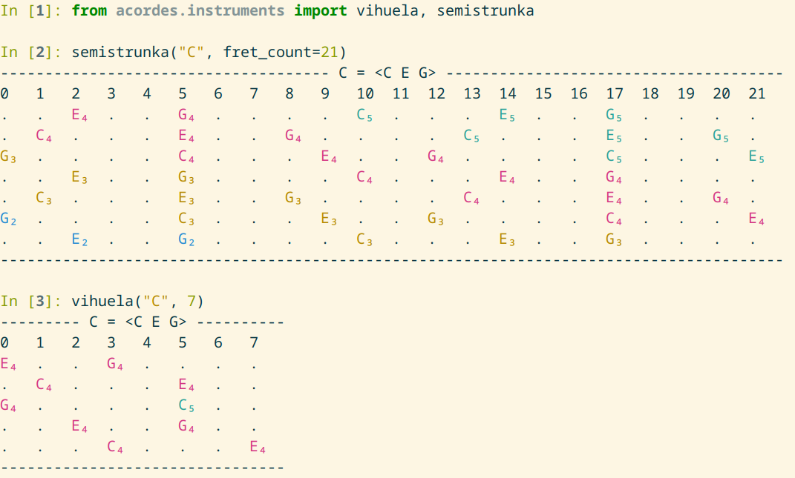

This package will help you determine how to play a chord on a stringed instrument. There are many sites dedicated to guitar or ukulele chords, but for some other instruments, chord tables are harder to find.

"Acordes" means "chords" in Spanish and Portuguese. Some of the possible pronunciations are [aˈkɔɦ.ʤis] (Brazilian Portuguese), [ɐˈkɔɾ.ðɨʃ] (European Portuguese), [aˈkoɾ.ðes] (Spanish).

# Installation

You need Python 3.10 or later. Create a virtual environment with a tool of your choice, *for example*:

```sh
python3 -m venv ~/venvs/acordes
```

Then install the package with `pip install acordes`.

For convenient interactive usage, add a snippet to your shell configuration file (e.g. `.bashrc` if you use Bash), *for example*:

```bash
acordes () {
    . ~/venvs/acordes/bin/activate
    python -i -c 'from acordes import *'
}
```

# Usage

```pycon
>>> from acordes import Tuning
>>> charango = Tuning("G4 C5 E A4 E5")
>>> charango("C7")
----------------- C7 = <C E G A#> -----------------
0   1   2   3   4   5   6   7   8   9   10  11  12
E₅  .   .   G₅  .   .   A#₅ .   C₆  .   .   .   E₆
.   A#₄ .   C₅  .   .   .   E₅  .   .   G₅  .   .
E   .   .   G   .   .   A#  .   C   .   .   .   E
C₅  .   .   .   E₅  .   .   G₅  .   .   A#₅ .   C₆
G₄  .   .   A#₄ .   C₅  .   .   .   E₅  .   .   G₅
---------------------------------------------------
>>> braguinha = Tuning("D4 G4 B4 D5")
>>> braguinha("Em")
------------------- Em = <E G B> ------------------
0   1   2   3   4   5   6   7   8   9   10  11  12
.   .   E₅  .   .   G₅  .   .   .   B₅  .   .   .
B₄  .   .   .   .   E₅  .   .   G₅  .   .   .   B₅
G₄  .   .   .   B₄  .   .   .   .   E₅  .   .   G₅
.   .   E₄  .   .   G₄  .   .   .   B₄  .   .   .
---------------------------------------------------
```


Supported tuning descriptions are:
- notes with octave numbers: `D4 G4 B4 D5`
- octave-invariant notes: `G C E A`
- mix of the two: `G4 C5 E A4 E5`

Octave-doubled strings are not supported. As a workaround, they can be notated
without an octave or with only one of their octaves.

Supported chord descriptions are (examples with C as the root note):
- with two notes: Cm(no5), C(no5), C5
- with three notes: Cdim, Csus2, C, Cm, Csus4, Caug
- with four notes: Cm6, C6, Cm7, CmM7, C7, CM7

If octave numbers are present in the tuning, the notes in the output are colored
so that notes of the same color form a non-inverted chord.

The `instruments` module contains a few predefined tunings. For some instruments,
there is only one tuning, for some there are many:

```pycon
from acordes.instruments import balalaika
>>> from acordes.instruments import balalaika
>>> balalaika.academic("Em")
------------------- Em = <E G B> -------------------
0   1   2   3   4   5   6   7   8   9   10  11  12  
.   .   B₄  .   .   .   .   E₅  .   .   G₅  .   .   
E₄  .   .   G₄  .   .   .   B₄  .   .   .   .   E₅  
E₄  .   .   G₄  .   .   .   B₄  .   .   .   .   E₅  
----------------------------------------------------
>>> balalaika.folk("Em")
------------------- Em = <E G B> -------------------
0   1   2   3   4   5   6   7   8   9   10  11  12  
G₄  .   .   .   B₄  .   .   .   .   E₅  .   .   G₅  
E₄  .   .   G₄  .   .   .   B₄  .   .   .   .   E₅  
.   .   .   .   E₄  .   .   G₄  .   .   .   B₄  .   
----------------------------------------------------
```

It's often hard to decide whether a tuning is *the* tuning for some instrument.
The list is incomplete and subjective. It's intended to be a helper, not a database.
Still, if you see something obviously wrong, please report it.

There is also an optional `fret_count` argument:

```
In [1]: from acordes.instruments import vihuela, semistrunka

In [2]: semistrunka("C", fret_count=21)
------------------------------------- C = <C E G> --------------------------------------
0   1   2   3   4   5   6   7   8   9   10  11  12  13  14  15  16  17  18  19  20  21  
.   .   E₄  .   .   G₄  .   .   .   .   C₅  .   .   .   E₅  .   .   G₅  .   .   .   .   
.   C₄  .   .   .   E₄  .   .   G₄  .   .   .   .   C₅  .   .   .   E₅  .   .   G₅  .   
G₃  .   .   .   .   C₄  .   .   .   E₄  .   .   G₄  .   .   .   .   C₅  .   .   .   E₅  
.   .   E₃  .   .   G₃  .   .   .   .   C₄  .   .   .   E₄  .   .   G₄  .   .   .   .   
.   C₃  .   .   .   E₃  .   .   G₃  .   .   .   .   C₄  .   .   .   E₄  .   .   G₄  .   
G₂  .   .   .   .   C₃  .   .   .   E₃  .   .   G₃  .   .   .   .   C₄  .   .   .   E₄  
.   .   E₂  .   .   G₂  .   .   .   .   C₃  .   .   .   E₃  .   .   G₃  .   .   .   .   
----------------------------------------------------------------------------------------

In [3]: vihuela("C", 7)
--------- C = <C E G> ----------
0   1   2   3   4   5   6   7   
E₄  .   .   G₄  .   .   .   .   
.   C₄  .   .   .   E₄  .   .   
G₄  .   .   .   .   C₅  .   .   
.   .   E₄  .   .   G₄  .   .   
.   .   .   C₄  .   .   .   E₄  
--------------------------------
```



# Development

Install (you should create an environment first): `pip install -e .`

Check types: `mypy`

Run a quick informal test: `python -m acordes.example`

Run formal tests: `pytest`

# Related Projects

A browser version by [formicant](https://github.com/formicant/) can be found [here](https://formicant.github.io/Griffbrett/), its source code [here](https://github.com/formicant/Griffbrett/).
